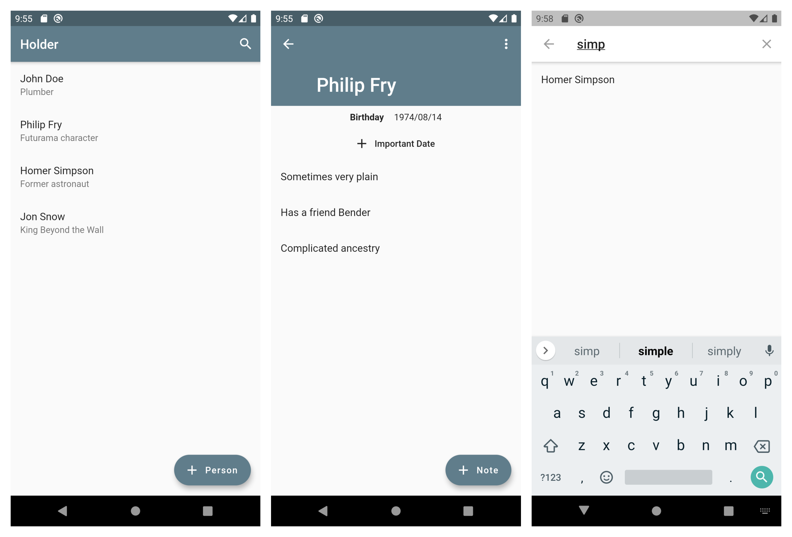

# Holder

> This a proof-of-concept app. Everything may change. Use at your own risk.

Holder helps you to remember important details about important people. It is a contacts app 
connected with note app. For each person you can create a profile and assign notes (details you
would like to remember) or dates (like birthday).



## Technical details

- [BLoC](https://pub.dev/packages/flutter_bloc) for state management.
- [freezed](https://pub.dev/packages/freezed) for sealed unions. It works really nicely with BLoC.
- [floor](https://pub.dev/packages/floor) for persistence. (Will be perfect once type adapters area added.)
- [get_it](https://pub.dev/packages/get_it) for dependency injection of services.
- [injectable](https://pub.dev/packages/injectable) for auto-registering services with `get_it`.

## Build

This project heavily uses `build_runner` for generating code. Run following command to trigger build run
when you change file.

```
flutter packages pub run build_runner watch
```
